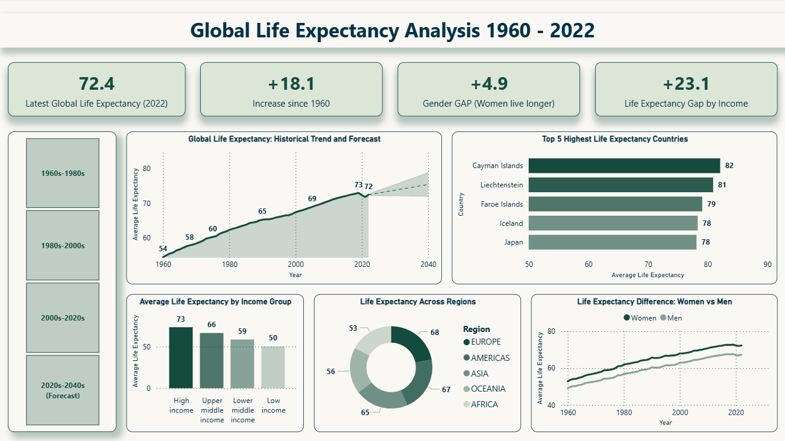

Power BI dashboard project with interactive report and data analysis.
The analysis shows three major insights:
1. Life expectancy has increased substantially since 1960.
2. Women consistently live longer than men worldwide.
3. Income level strongly influences longevity, revealing persistent global inequality.
Through DAX calculations, interactive slicers, forecasting and comparative visualizations, this dashboard transforms historical data into meaningful insights about global development.

